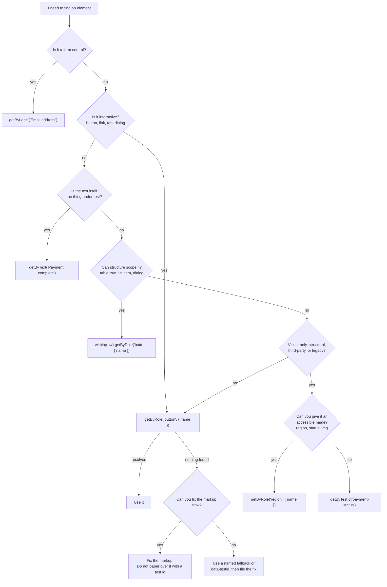
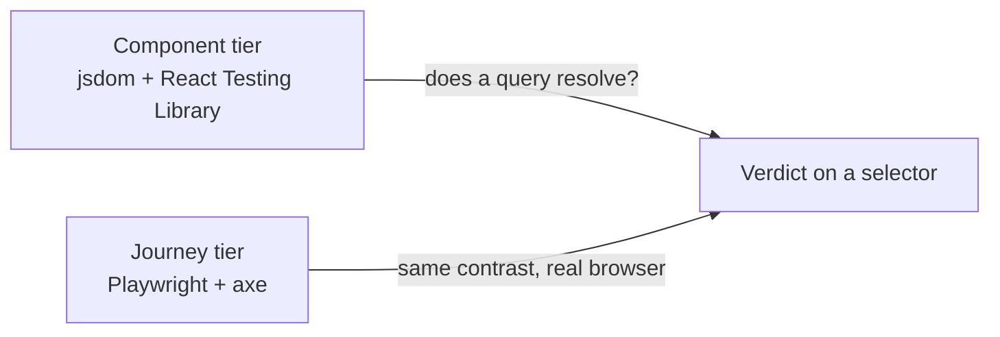

# data-testid, good and bad, side by side

> Teaching repo. Every UI pattern has a good variant (semantic markup) and a bad one (test ids only). `pnpm test` runs component tests in jsdom; `pnpm test:e2e` runs Playwright + axe in a real browser. You need Node 20+ and pnpm. After a test run, open [docs/component-stories.html](docs/component-stories.html) and [docs/e2e-stories.html](docs/e2e-stories.html).

Ask three engineers how a test should find a button and you will get a fight.

One camp has been burned by flaky selectors. They watched a CSS refactor or a one-word copy change turn a green suite red overnight, and they reached for `data-testid` because it is the one handle nobody edits by accident. A QA lead with fifteen years on the job will tell you that text on a marketing site changes daily, that localization breaks every text selector you own, and that a clickable arrow icon has no text to match in the first place. To this camp a test id is not a smell. It is the thing that keeps the suite alive on a Monday after the design team shipped over the weekend.

The other camp says the test id is the smell. [Dominik Dorfmeister](https://tkdodo.eu/blog/test-ids-are-an-a11y-smell) (TkDodo) has not typed one in over a decade, and his objection is specific: a test that clicks `getByTestId('submit')` passes whether the element is a real `<button>` or a `<div>` that no keyboard and no screen reader can reach. Testing Library encodes the same position in its query priority, where the test id ranks dead last, behind role, label, and visible text. A role-based query does two jobs in one line. It finds the element, and it proves a real user could find it too.

Then [Playwright's locator guide](https://playwright.dev/docs/locators) pours fuel on the fire. The intro tells you to prefer user-facing locators like `getByRole`. The [test id section](https://playwright.dev/docs/locators#locate-by-test-id) on the same page calls test ids "the most resilient way of testing" because they survive text and role changes. Both sentences are true. That contradiction is why the thread never dies, and why a developer can quote the docs at you no matter which side they started on.

This repo settles the fight the only honest way: it builds every surface twice, a good semantic version and a bad test-id-only version, then runs the same tests against both so you watch the disagreement resolve in your terminal.

## Where this lands

Use the most user-facing selector that is stable enough for the job.

That rule answers the selector question. It does not answer the maintenance question. You can still wrap selectors in page objects, screen objects, or helper functions. The abstraction and the selector are two separate choices.

Reach for role and name first, fall back to label, then to visible text, and keep `data-testid` for the cases where the user-facing options genuinely do not exist or do not hold still.

If you have to choose, keep the accessible markup and adapt the test strategy around it. Do not make the UI less accessible to get a more convenient selector.



Testing Library's priority guide is broader than this tree. This tree is the repo's opinionated shortcut for the cases these examples cover, including the common "legacy rescue work" branch when you cannot fix the markup this sprint.

The asymmetry between the top of that chart and the bottom is the whole lesson. A role query that passes also proves the element is reachable. A test id that passes tells you a string exists in the DOM and nothing else.

## The four moves to watch for

Reading about this settles nothing, so the suites make it concrete. Four patterns recur.

### 1. The bad selector passes anyway

The login form rebuilt out of divs. There is no `<form>`, the inputs have a placeholder instead of a label, and the submit "button" is a `<div>` with an `onClick`.

```tsx
// src/examples/LoginForm.tsx (bad)
<div data-testid="login-form">
  <input data-testid="email-input" type="email" placeholder="Email address" />
  <input data-testid="password-input" type="password" placeholder="Password" />
  <div data-testid="login-submit-btn" onClick={() => onSubmit({ email, password })}>
    Sign in
  </div>
</div>
```

```tsx
// tests/component/login-form.story.test.tsx
await user.type(screen.getByTestId('email-input'), 'jag@example.com')
await user.click(screen.getByTestId('login-submit-btn'))
expect(onSubmit).toHaveBeenCalledWith({ email: 'jag@example.com', password: 'hunter2' })
// passes. green, and blind to the fact that nobody can tab to that "button".
```

### 2. The good selector fails against the bad markup, and that failure is the point

Run a role and label query against the same broken form and it cannot find a thing. The test caught the accessibility bug the test id hid.

```tsx
render(<LoginFormBad />)
expect(screen.queryByRole('button', { name: 'Sign in' })).toBeNull()   // it is a div
expect(screen.queryByLabelText('Email address')).toBeNull()            // placeholder, not a label
```

Now the good version. Real `<form>`, labels tied to inputs, a real submit button. The same role and label query that failed above now drives the whole form.

```tsx
// src/examples/LoginForm.tsx (good)
<form aria-label="Sign in" onSubmit={handleSubmit}>
  <label htmlFor="login-email">Email address</label>
  <input id="login-email" name="email" type="email" />
  <label htmlFor="login-password">Password</label>
  <input id="login-password" name="password" type="password" />
  <button type="submit">Sign in</button>
</form>
```

```tsx
await user.type(screen.getByLabelText('Email address'), 'jag@example.com')
await user.click(screen.getByRole('button', { name: 'Sign in' }))
// the selectors that find it also prove a real user could.
```

### 3. The accessible route first, the test id only when it runs out

A status region looks like the classic test id case. But a `<section>` named by its heading is a landmark, and a role query reaches it the way a screen-reader user navigates to it. The id earns nothing here.

```tsx
// src/examples/PaymentStatus.tsx (good: a named region, no test id)
<section aria-labelledby="payment-status-heading">
  <h2 id="payment-status-heading">Payment status</h2>
  <p>{status}</p>
</section>
```

```tsx
const region = screen.getByRole('region', { name: 'Payment status' })
expect(region).toHaveTextContent('Payment complete')   // role locates, text verifies
```

When the status lands after an API call, `role="status"` makes it a live region a screen reader announces, and the test reads it the same way the user is told:

```tsx
<p role="status">{status}</p>
```

```tsx
expect(screen.getByRole('status')).toHaveTextContent('Payment complete')
```

Only when a wrapper has no heading and groups nothing a user would name does the test id earn the scope:

```tsx
const region = screen.getByTestId('payment-status')   // last resort, after the role options
expect(region).toHaveTextContent('Payment complete')
```

### 4. axe passes, the label query does not

The broken login inputs carry a placeholder instead of a label. Run axe over them and axe stays quiet, because a placeholder counts as an accessible name in the name-computation algorithm. The label query still finds nothing, and a real user loses that placeholder the moment they start typing.

```ts
// e2e/accessibility.story.spec.ts
const results = await new AxeBuilder({ page })
  .include('section[aria-label="Login form (bad)"]')
  .analyze()
const serious = results.violations.filter((v) => v.impact === 'serious' || v.impact === 'critical')
expect(serious).toEqual([])                                   // axe is satisfied
await expect(region.getByLabel('Email address')).toHaveCount(0) // the label selector is not
```

axe and role queries catch different bugs. Here the label selector is the safety net, and axe is not. Neither alone is enough.

## More good and bad pairs

### Icon button, no visible text

```tsx
// bad: no role, no name, no keyboard access. only a test id reaches it.
<div data-testid="delete-payment" onClick={onDelete}><Trash2 /></div>

// good: the name comes from aria-label, the icon is decorative.
<button type="button" aria-label="Delete payment" onClick={onDelete}>
  <Trash2 aria-hidden="true" />
</button>
```

```tsx
await user.click(screen.getByRole('button', { name: 'Delete payment' }))   // good
expect(screen.queryByRole('button', { name: 'Delete payment' })).toBeNull() // against the bad version
```

### Dialog

```tsx
// bad: a clickable div opens a plain div. assistive tech sees no dialog.
<div data-testid="open-widget" onClick={() => setOpen(true)}>Open widget</div>
{open && <div data-testid="widget-dialog">…</div>}

// good: a real button opens a real dialog with a name.
<button type="button" onClick={() => setOpen(true)}>Open widget</button>
{open && <div role="dialog" aria-modal="true" aria-label="Widget">…</div>}
```

```tsx
await user.click(screen.getByRole('button', { name: 'Open widget' }))
expect(screen.getByRole('dialog', { name: 'Widget' })).toBeInTheDocument()
// against the bad version:
expect(screen.queryByRole('dialog')).toBeNull()
```

### Repeated rows

Three "Add to basket" buttons read identically. The bad version separates them by index, which carries no meaning and breaks on reorder. The good version gives each a per-product name.

```tsx
// bad
<div data-testid={`add-${index + 1}`} onClick={() => onAdd(product.id)}>Add to basket</div>

// good
<button type="button" aria-label={`Add ${product.name} to basket`} onClick={() => onAdd(product.id)}>
  Add to basket
</button>
```

```tsx
await user.click(screen.getByRole('button', { name: 'Add Wool Socks to basket' }))  // exact, by name
await user.click(screen.getByTestId('add-2'))                                       // "the second one, today"
```

When two rows read the same, identical product and identical text, the per-row name runs out and a test id is the only handle left. Key it on a stable business identifier like a slug or SKU:

```tsx
<article data-testid={`product-card-${product.sku}`}>   // holds across a reorder and a fresh CI database
<article data-testid={`product-card-${index}`}>         // moves the moment the list re-sorts
<article data-testid={`product-card-${product.dbId}`}>  // CI seeds a new database, so the number differs and the selector misses
```

A slug or SKU points at the same product in every environment you run the suite. An index only tracks position, so re-sorting the list aims it at the wrong row, and a primary key from your dev database becomes a different number in CI.

### Order table

Tables already give you structure. Scope to the row header first, then find the action inside that row. Only fall back to a stable invoice id when the row text is too noisy or unstable to be the contract.

```tsx
const rowHeader = screen.getByRole('rowheader', { name: 'INV-002' })
const row = rowHeader.closest('tr')
await user.click(within(row!).getByRole('button', { name: 'Refund' }))

await user.click(screen.getByTestId('refund-order-INV-002')) // fallback: stable business id
```

### Localized copy

Localization does not force you into test ids. If the translated label is still the contract, use the same messages source the app uses. If the locale copy comes from a CMS or an experiment, move the test contract behind a stable id and assert the text separately.

```tsx
await user.click(screen.getByRole('button', { name: checkoutLabel('fr') }))

const button = screen.getByTestId('checkout-primary-action')
expect(button).toHaveTextContent('Terminer l’achat en sécurité')
```

### Page object API

A page object solves duplication. It does not decide whether the underlying locator should be semantic or a test id. Start with the user-facing locator. Swap the internals only when the contract becomes unstable.

```ts
class ReviewPage {
  sendBackToReviewer() {
    return page.getByRole('button', { name: 'Send back to reviewer' }).click()
  }
}
// if the copy becomes unstable, the method can switch to getByTestId(...)
```

### Dynamic copy, where a test id earns its place

The checkout label is A/B tested, so the wording is not stable enough to select on. The id is the stable handle, and when the wording matters you assert it separately on the same element.

```tsx
<button type="button" data-testid="checkout-primary-action">{label}</button>
```

```tsx
const button = screen.getByTestId('checkout-primary-action')
await user.click(button)                              // drive the flow by the stable id
expect(button).toHaveTextContent('Continue securely') // assert the copy when it is a requirement
```

### Naming

Same two buttons, three ways. The lesson is not that test ids are bad. It is that you name things by meaning.

```tsx
<button>Save</button>                                       // good: found by role + name, no id
<button data-testid="button-1">Save</button>                // bad: tells a future reader nothing
<button data-testid="profile-save-button">Save</button>     // fine: domain + purpose + element, kebab-case
```

And the anti-pattern, a test id on every nesting level, where none of them identify anything that matters:

```tsx
<div data-testid="page-wrapper">
  <div data-testid="content-wrapper">
    <div data-testid="form-wrapper">
      <button data-testid="button-1">Save</button>
    </div>
  </div>
</div>
```

## Getting there when the role query fails

When a role query fails, the markup is usually one change from reachable, and the change is worth making because a user benefits from the same fix. The moves that get you there:

- **Name the region.** Point `aria-labelledby` at a heading, or add `aria-label`, and a `<section>` becomes a landmark you query by name: `getByRole('region', { name: 'Payment status' })`.
- **Announce async changes.** A status that appears after a fetch belongs in a live region. `role="status"` carries an implicit `aria-live="polite"`, so a screen reader announces it and the test gets `getByRole('status')`.
- **Summarize a graphic you cannot fix.** Wrap a third-party chart in a container with `role="img"` and an `aria-label`. The screen reader gets the gist, the test gets `getByRole('img', { name })`.
- **Scope instead of tagging.** When text repeats, narrow to a structure first: `within(getByRole('listitem')…)` or `within(getByRole('dialog', { name }))`. No new id required.
- **Keep a label without showing it.** A control that needs no visible label still needs an accessible one. A `VisuallyHidden` component or an `sr-only` class keeps the name in the tree and out of the layout.
- **Read the tree, not the DOM.** [Testing Playground](https://testing-playground.com/) and the accessibility panel in your browser devtools show the role and name an element actually exposes, which is the selector you want.

Change the markup first, and reach for the id only when these run out.

## For the maintainer

You still need to care about the person carrying this suite six months from now.

- Centralize selectors behind a page object, screen object, or helpers module. That cuts churn without forcing every selector to become a test id.
- Use the same translation source in tests when a control is localized and the wording itself is still the contract.
- Scope by structure before you mint a new id. A table row, list item, dialog, or region often gives you the handle you need.
- If you do add `data-testid`, make it describe the business thing that stays stable across refactors: `refund-order-INV-002`, not `row-2`.
- Treat test ids as contracts. If you add one, own it the way you own a public API.

## The map

Each component exports its good and bad variants, paired with the tests that prove the contrast.

| What it shows | Component | Tests |
| --- | --- | --- |
| A `<div>` form vs a semantic form | [`src/examples/LoginForm.tsx`](src/examples/LoginForm.tsx) | [`login-form`](tests/component/login-form.story.test.tsx), [`selectors`](e2e/selectors.story.spec.ts), [`accessibility`](e2e/accessibility.story.spec.ts) |
| An icon button that needs an accessible name | [`src/examples/IconButton.tsx`](src/examples/IconButton.tsx) | [`icon-button`](tests/component/icon-button.story.test.tsx), [`selectors`](e2e/selectors.story.spec.ts) |
| A clickable-div "dialog" vs a real dialog | [`src/examples/WidgetDialog.tsx`](src/examples/WidgetDialog.tsx) | [`widget-dialog`](tests/component/widget-dialog.story.test.tsx), [`selectors`](e2e/selectors.story.spec.ts) |
| Repeated rows: per-row name, SKU fallback, and `add-1`/`add-2` | [`src/examples/ProductList.tsx`](src/examples/ProductList.tsx) | [`product-list`](tests/component/product-list.story.test.tsx), [`selectors`](e2e/selectors.story.spec.ts) |
| Table scoping by row header vs stable invoice id fallback | [`src/examples/OrderTable.tsx`](src/examples/OrderTable.tsx) | [`order-table`](tests/component/order-table.story.test.tsx) |
| Named region and live region vs a status-container test id | [`src/examples/PaymentStatus.tsx`](src/examples/PaymentStatus.tsx) | [`legitimate-test-ids`](tests/component/legitimate-test-ids.story.test.tsx) |
| A good test id for A/B-tested copy | [`src/examples/CheckoutButton.tsx`](src/examples/CheckoutButton.tsx) | [`legitimate-test-ids`](tests/component/legitimate-test-ids.story.test.tsx) |
| Localized copy with shared messages vs unstable locale copy fallback | [`src/examples/LocalizedActions.tsx`](src/examples/LocalizedActions.tsx) | [`localized-actions`](tests/component/localized-actions.story.test.tsx) |
| A live-region spinner vs a decorative test-id spinner | [`src/examples/LoadingSpinner.tsx`](src/examples/LoadingSpinner.tsx) | [`legitimate-test-ids`](tests/component/legitimate-test-ids.story.test.tsx) |
| A `role="img"` chart wrapper vs a test-id wrapper | [`src/examples/SalesChart.tsx`](src/examples/SalesChart.tsx) | [`legitimate-test-ids`](tests/component/legitimate-test-ids.story.test.tsx) |
| Page object over `getByRole` vs page object over `getByTestId` | [`src/examples/ReviewActions.tsx`](src/examples/ReviewActions.tsx) | [`selectors-api`](tests/component/selectors-api.story.test.tsx) |
| Naming: `button-1` vs `profile-save-button` | [`src/examples/SaveButtons.tsx`](src/examples/SaveButtons.tsx) | [`naming`](tests/component/naming.story.test.tsx) |
| Wrapper soup: a test id on every nesting level | [`src/examples/PaymentStatus.tsx`](src/examples/PaymentStatus.tsx) (`WrapperSoup`) | [`naming`](tests/component/naming.story.test.tsx) |

Two tiers run the examples. Component tests use jsdom and React Testing Library, so you see a query pass or fail in isolation. Browser journeys use Playwright with an axe pass, so you see the same contrast in a real DOM. Both tiers write HTML reports to [docs/component-stories.html](docs/component-stories.html) and [docs/e2e-stories.html](docs/e2e-stories.html) on every run, through [executable-stories](https://github.com/jagreehal/executable-stories).



## Run it

Requires Node 20+ and [pnpm](https://pnpm.io/installation).

```bash
pnpm install
pnpm exec playwright install   # first time only, if browsers are missing
pnpm test                      # component tier: jsdom + React Testing Library
pnpm test:e2e                  # journey tier: Playwright, auto-starts the demo app
pnpm typecheck
pnpm dev                       # open http://localhost:5173 and read both versions
```

After `pnpm test` or `pnpm test:e2e`, open [docs/component-stories.html](docs/component-stories.html) and [docs/e2e-stories.html](docs/e2e-stories.html) for the generated story reports.

## When a test id is the right call

Most teams do not fight about accessibility in the abstract.

They fight about maintenance.

Copy changes. Localization swaps strings. A third-party date picker ships a new DOM. Twenty tests break and somebody asks why they did not just use a test id.

That pressure is real. It still does not justify using `data-testid` as the first locator for everything. It just tells you where the stable contract belongs.

A test id is a fallback for the test contract. It is not permission to skip labels, roles, names, focus behavior, or keyboard support.

The escape hatch earns its place for:

- copy that product or marketing changes on purpose, such as A/B-tested CTAs like `data-testid="checkout-primary-action"`
- localized text when the wording comes from a CMS, an experiment, or another source the test should not mirror directly
- repeated items that a user-facing name cannot disambiguate, keyed on a stable business identifier like `data-testid="product-card-wool-socks"` or `data-testid="line-item-SKU-8472"`, never `item-2` or a database primary key
- third-party widgets whose internal DOM you do not own, after you give the wrapper you own an accessible role and name
- structural hooks that expose no useful role, label, or name, such as a legacy container you need to scope into before you can assert on real user-facing content
- legacy rescue work, where you need a stable hook today and a markup fix will land later

Name it by meaning, in kebab-case: `payment-summary`, `checkout-primary-action`. Never `btn-1`, `test`, or `blue-wrapper-left-column-v2`.

## Three things the debate usually skips

**Most objections are about maintenance, not semantics.** If you inline selectors in hundreds of tests, you will hate changing them. That is a real problem. Solve it with a page object, screen object, or selectors module. Use the same translation helper the app uses. Scope to the row or the dialog before you mint a new id. Do not solve every maintenance problem with `data-testid`.

**Page objects hide the choice.** A test id is rarely the abstraction you want spread across the whole suite. Wrap the selector so the test reads like a business flow and the selector can change underneath without touching the test.

```ts
class ReviewPage {
  constructor(private readonly page: Page) {}
  sendBackToReviewer() {
    return this.page.getByRole('button', { name: 'Send back to reviewer' }).click()
  }
}
// if the copy becomes unstable, swap the internals to a test id. the test does not care.
```

**Stripping test ids from production is a team decision, not a rule.** Keep them everywhere and one suite runs in CI, staging, and against production. Strip them from public builds and your production monitoring needs user-facing selectors instead. Or use a custom attribute like `data-cy`, which Playwright can be configured to read. The name matters less than the discipline around it.

## The bottom line

Role, label, and text give you fidelity: they prove a real user could do what the test did. `data-testid` gives you stability when the user-facing options are dynamic, localized, third-party, or trapped in legacy markup. A suite worth trusting uses both, and the skill is knowing which one this test needs. Every test id should carry a reason: we chose this because it makes the test clearer, more stable, or possible, without pretending it is how a user finds the element. Used that way it is a tool, not a smell. The mistake was never using it. The mistake is using it without thinking.
